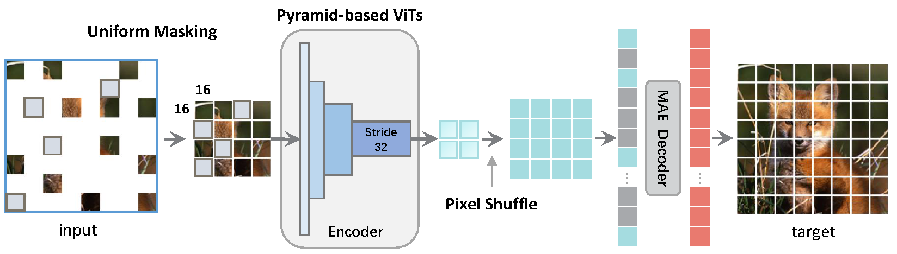

<div align="center">
<h1>UM-MAE</h1>
<h3>Uniform Masking: Enabling MAE Pre-training for Pyramid-based Vision Transformers with Locality</h3>

[Xiang Li](https://scholar.google.com/citations?user=oamjJdYAAAAJ&hl=zh-CN), [Wenhai Wang](https://scholar.google.com/citations?user=WM0OglcAAAAJ&hl=zh-CN), [Lingfeng Yang](https://scholar.google.com/citations?user=RLhH0jwAAAAJ&hl=zh-CN), [Jian Yang](https://scholar.google.com/citations?user=6CIDtZQAAAAJ&hl=zh-CN)

</div>

* This repo is a modification on the [MAE repo](https://github.com/facebookresearch/mae). Installation and preparation follow that repo.

* This repo is based on [`timm==0.3.2`](https://github.com/rwightman/pytorch-image-models), for which a [fix](https://github.com/rwightman/pytorch-image-models/issues/420#issuecomment-776459842) is needed to work with PyTorch 1.8.1+.

* This repo is the official implementation of [Uniform Masking: Enabling MAE Pre-training for Pyramid-based Vision Transformers with Locality](https://arxiv.org/pdf/2205.10063.pdf). It includes codes and models for the following tasks:
> **ImageNet Pretrain**: See [PRETRAIN.md](PRETRAIN.md).\
> **ImageNet Finetune**: See [FINETUNE.md](FINETUNE.md).\
> **Object Detection**: See [DETECTION.md](DET/DETECTION.md).\
> **Semantic Segmentation**: See [SEGMENTATION.md](SEG/SEGMENTATION.md). \
> **Visualization**: See [Colab notebook](https://colab.research.google.com/github/implus/UM-MAE/blob/main/visual/ummae_visualize.ipynb).

```
@article{Li2022ummae,
  author  = {Li, Xiang and Wang, Wenhai and Yang, Lingfeng and Yang, Jian},
  journal = {arXiv:2205.10063},
  title   = {Uniform Masking: Enabling MAE Pre-training for Pyramid-based Vision Transformers with Locality},
  year    = {2022},
}
```

## Updates

***30/May/2022:***  Visualization code/demo is updated at [Colab notebook](https://colab.research.google.com/github/implus/UM-MAE/blob/main/visual/ummae_visualize.ipynb).

***26/May/2022:***  The Chinese blog of this paper is available at [zhihu](https://zhuanlan.zhihu.com/p/520228061).

***23/May/2022:***  The preprint version is public at [arxiv](https://arxiv.org/pdf/2205.10063.pdf).

## Motivation
(a) In MAE, the **global** window of Vanilla ViT can receive arbitrary subset of image patches by skipping random 75% of the total, whilst (b) skipping these 75% patches is unacceptable for Pyramid-based ViT as patch elements are not equivalent across the **local** windows. (c) A straightforward solution is to adopt the mask token for the encoder (e.g., SimMIM) at the cost of slower training. (d) Our Uniform Masking (UM) approach (including Uniform Sampling and Secondary Masking) enables the efficient MAE-style pre-training for Pyramid-based ViTs while keeping its competitive fine-tuning accuracy.
<p align="center">
  
</p>

## Introduction
UM-MAE is an efficient and general technique that supports MAE-style MIM Pre-training for popular Pyramid-based Vision Transformers (e.g., PVT, Swin).
* We propose Uniform Masking, which successfully enables MAE pre-training (i.e., UM-MAE) for popular Pyramid-based ViTs.  
* We empirically show that UM-MAE considerably speeds up pre-training efficiency by ~2X and reduces the GPU memory consumption by at least ~2X compared to the existing sota Masked Image Modelling (MIM) framework (i.e, SimMIM) for Pyramid-based ViTs, whilst maintaining the competitive fine-tuning performance. Notably, using HTC++ detector, the pre-trained Swin-Large backbone self-supervised under UM-MAE only in ImageNet-1K (57.4 AP^bbox, 49.8 AP^mask) can even outperform the one supervised in ImageNet-22K (57.1 AP^bbox, 49.5 AP^mask).
* We also reveal and discuss several notable different behaviors between Vanilla ViT and Pyramid-based ViTs under MIM.


## Main Results on ImageNet-1K
| Models  | Pre-train Method| Sampling Strategy | Secondary Mask Ratio | Encoder Ratio | Pretrain Epochs | Pretrain Hours | FT acc@1(%) | FT weight/log |
| :---:   | :---: | :---: | :---: | :---: | :---: | :---: | :---: | :---: |
| ViT-B   | MAE          | RS | --  | 25%  | 200 | todo | 82.88 | [weight](https://drive.google.com/file/d/1wsqOzSTK27TP5b6FM5fEXLYNRc88IXy2/view?usp=sharing)/[log](https://drive.google.com/file/d/1UtFmWLtIA7AaE3pVdksCcafVrtkTz5m5/view?usp=sharing) |
| ViT-B   | MAE          | UM | 25% | 25%  | 200 | todo | 82.88 | [weight](https://drive.google.com/file/d/1cCONx1o2e73GjW506KTPv0yfRtFSWJvs/view?usp=sharing)/[log](https://drive.google.com/file/d/1CIHRwAlWpvlDI8wM3rtSVRJC8NsQ9zw5/view?usp=sharing)  |
| PVT-S   | SimMIM       | RS | --  | 100% | 200 | 38.0 | 79.28 | [weight](https://drive.google.com/file/d/1ZJf98EVNlX3UIBD_Ss5hwzhGmBi8LYM1/view?usp=sharing)/[log](https://drive.google.com/file/d/1oqOrJBNpkPtR57dJIXM5dPi22CpVhN9C/view?usp=sharing) |
| PVT-S   | UM-MAE       | UM | 25% | 25%  | 200 | 21.3 | 79.31 | [weight](https://drive.google.com/file/d/1wKBsh-G9knebYgcv4Lv5UnQQkCrnqkpH/view?usp=sharing)/[log](https://drive.google.com/file/d/1dAsF97o35v4pWkRiiTJroapEZy8loQ09/view?usp=sharing) |
| Swin-T  | SimMIM       | RS | --  | 100% | 200 | 49.3 | 82.20 | [weight](https://drive.google.com/file/d/1NbgNGmZDxwgRcO9OKhBSJwGBj9-3A5eL/view?usp=sharing)/[log](https://drive.google.com/file/d/1DU8_vUYUfPogbXu6JuJO_nKN97VnwiSr/view?usp=sharing) |
| Swin-T  | UM-MAE       | UM | 25% | 25%  | 200 | 25.0 | 82.04 | [weight](https://drive.google.com/file/d/1VPUSNljE3orSl-d6vMBo5jtvYeEipZu2/view?usp=sharing)/[log](https://drive.google.com/file/d/1bvdeAq2UKhW2zEcdgOyMkiayR-N6ntgU/view?usp=sharing) |
| Swin-L  | SimMIM       | RS | --  | 100% | 800 | --   | 85.4  | [link](https://github.com/microsoft/SimMIM) |
| Swin-L  | UM-MAE       | UM | 25% | 25%  | 800 | todo | 85.2  | [weight](https://drive.google.com/file/d/1ih3vNM_rrArLR67UPSbUy_YG23lGAFjU/view?usp=sharing)/[log](https://drive.google.com/file/d/1Klws_uXhHc2z-bPJIifQQ_1Pg8VuyoB4/view?usp=sharing) |

RS: Random Sampling; UM: Uniform Masking, consisting of **Uniform** Sampling and Secondary **Masking**

## Acknowledgement
The pretraining and finetuning of our project are based on [DeiT](https://github.com/facebookresearch/deit), [MAE](https://github.com/facebookresearch/mae) and [SimMIM](https://github.com/microsoft/SimMIM). The object detection and semantic segmentation parts are based on [MMDetection](https://github.com/open-mmlab/mmdetection) and [MMSegmentation](https://github.com/open-mmlab/mmsegmentation) respectively. Thanks for their wonderful work.


### License
This project is under the CC-BY-NC 4.0 license. See [LICENSE](LICENSE) for details.
